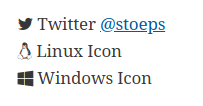
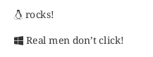

= Documentation With Any Editor
:email: christoph.stoettner@stoeps.de
:revnumber: 1.0
:revdate: 23.08.2018
:revremark: Initial Release
:encoding: utf-8
:lang: en
:title-logo-image: image::images/logo.png[]
:toc:
:doctype: article
:quick-uri: http://www.stoeps.de
:numbered!:
:experimental:
:revealjs_controls: false
:revealjs_progress: true
:revealjs_center: false
:revealjs_slideNumber: true
:revealjs_history: true
:revealjs_previewLinks: true
:syntax-highlighter: rouge
:icons: font
:customcss: css/custom.css
//////
:title-slide-background-image: images/dnug45/dnug45-logo.png
:title-slide-background-size: 300px auto
:title-slide-background-position: right 20px top 20px
//////
// :docinfo1: true

:slide: slide-froscon.adoc
:titleslide: title.adoc
:twitter-tag: @stoeps
:conference-tag: #froscon18
:talk-tag: #AnyEditor

include::_attributes.adoc[]

++++
<!--
<h2>für IBM Connections und IBM Domino</h2>
-->

   
<small>Christoph Stoettner</small>

   <!--p><small>+49 173 8588719</small></p-->
   <!--p><small>christoph.stoettner@stoeps.de</small></p-->

++++

== Shoutout / Contribution

* First of all a big thank you to:
 ** Organisation team of Froscon 2018
 ** https://asciidoctor.org[Asciidoctor] developers
 ** https://doctoolchain.github.io/docToolchain/[DocToolChain] developers
* Thanks to all sponsors and attendees

== Christoph Stoettner
include::{slide}[]

//
// [cols="3,7"]
// |===
// a|
// ++++
// 

// ++++
// image::images/stoeps.png[300,200]
// // icon:phone[] +49 173 8588719 +
// icon:envelope[] mailto:christoph.stoettner@stoeps.de[christoph.stoettner@stoeps.de] +
// icon:linkedin[] https://linkedin.com/in/christophstoettner[linkedin.com/in/christophstoettner] +
// icon:link[] https://www.stoeps.de[www.stoeps.de] +
// //icon:skype[] christophstoettner +
// icon:twitter[] https://twitter.com/stoeps[@stoeps] +
// ++++
// 

// ++++
// a|
//
* IBM Application Servers
** Installation, Configuration
** Performance Optimization, Stresstesting
* Started with Linux / OSS around 1994/1995
** Linux Kernel < 1.0
** Slackware
* VIM lover
** maybe too stupid for Emacs
// |===

== My history of documentation
include::{slide}[]

* Content of most of my documentations
** Config options (XML, GUI)
** Screenshots (GUI)
** Parts of Property Files
* Used tools
** MS Excel / Libreoffice (with Dropbox)
** MS Word / Libreoffice with Sharepoint or Mail
** Several Wiki engines
** Evernote

[NOTE.speaker]
--
* Mostly influenced from colleagues which only knew office products.
* Later influenced from Mac lovers (Evernote).
* but also manually configure monitoring is lame
--

== My needs
include::{slide}[]

* Searchable documentation
* Editing on mobile, tablet, notebook, customer computer, server (ssh)
* Output formats depend on customer and project
* No manual task to update output format
* Offline support
* Versioning

== Why did I stop using Cloud or Office products
include::{slide}[]

* Evernote
** Linux client long time a problem
** new license limits device count
** No markdown support
* Office
** compatibility
** Edit on different devices, versions
** sometimes switching printer is enough to flip images around

== Why not using a wiki?
include::{slide}[]

* Edit from mobile often not possible
* Documenting the Wiki itself?
* Not accessible when down
* Syntax different from one wiki to another
* Customer / PM often needs something printer friendly

== Markdown and rst
include::{slide}[]

* Started writing in Markdown
* Some software supports markdown directly
* Cool WYSIWIG editors
* Great for typing notes (Still using it on mobile)
* A little bit to simple
 ** including source files missing

== Asciidoc / Asciidoctor
include::{slide}[]

* Only some short syntax tips
* More automation later
* Differences to Markdown
** https://github.com/asciidoctor/asciidoctor.org/blob/master/docs/_includes/asciidoc-vs-markdown.adoc[role=long]
* Text only
** Version Control with GIT

== Syntax - Headings
include::{slide}[]

[source, role=half]
----
 :numbered: # <1>

 == H2
 === H3
 ==== H4

 :!numbered: # <2>

 == H2
 === H3
 ==== H4
----
<1> Headings numbered
<2> Headings without numbers

+++

<ul>
<li>H1 only appears once in Asciidoctor</li>
<li>numbered can be set in document header for all headings</li>
</ul>

+++

== Heading above blocks and images
include::{slide}[]

* Can be used with images and all kind of blocks, no TOC entry

[source,indent=0, role=half]
----
 .Heading // <1>
 [source]
 ----
 ls -al
 ----

 .Image // <2>
 image::images/test.png[]
----
<1> Heading above Code block
<2> Image heading

== Syntax - Lists
include::{slide}[]

[source, role=half]
----
=== Bullet Points

* Bullet Points
 ** Sub Bullet Point

=== Numbered Lists
. Numbered List
.. Sub 1
.. Sub 2
. Numbered 2

=== Definition Lists

CPU:: The brain of the computer.
Hard drive:: Permanent storage for operating system...
----

== Links, Images
include::{slide}[]

.Links
[source,asciidoc]
----
 https://www.stoeps.de[]        ;; <1>
 https://www.stoeps.de[Stoeps]  ;; <2>
----
<1> Shows just the link
<2> Link text in brackets

.Images
[source]
----
image::sunset.jpg[]
image::sunset.jpg[role=right] // <1>
image::sunset.jpg[Sunset]     // <2>
----
<1> You can add roles to all elements and use CSS for formatting
<2> Add a title tag to image

== Use Inline Icons
include::{slide}[]

* You can add any Font Awesome Icon
* Enable in document header

[source]
----
:icons: font
----

.Some Examples
[source, role=quad]
----
icon:twitter[] Twitter https://twitter.com[@stoeps]
icon:linux[] Linux Icon
icon:windows[] Windows Icon
----

== Admonition Blocks
include::{slide}[]

* Admonition blocks (Warning, Caution, Important, Note, Tip)
* Font-Awesome Icons with `:icons: font`

[source, asciidoc]
----
WARNING: This is a warning
----

WARNING: This is a warning

[source,asciidoc]
----
CAUTION: This is a caution
----

CAUTION: This is a caution

[source,asciidoc]
----
IMPORTANT: This is important
----

IMPORTANT: This is important

== Admonition Blocks in Html and PDF
include::{slide}[]

[source, role=half]
----
NOTE: A note

TIP: Here is a tip

IMPORTANT: That's important

WARNING: Warning message

CAUTION: Caution, be careful
----

== Menus, Keys and Buttons
include::{slide}[]

[source]
----
:experimental: // <1>
----
<1> Following features need experimental set

[source]
----
.Copy Text
menu:Edit[Copy Special > Text]

.Button
Press kbd:[OK]

.Keyboard
kbd:[Ctrl+C] to stop this.
----

== Sourcecode
include::{slide}[]

* Adding [source]
[source, indent=0]
----
 .A Python function
 [source,python]
 ----
 def function():
    var x = 10
    return x
 ----
----

.A Python function
[source,python]
----
def function():
    var x = 10
    return x
----

* Syntax Highlighting with Pygments, Highlightjs or Rouge

[source]
----
:source-highlighter: pygments
----

== Including Files
include::{slide}[]

* Split longer documents and include Asciidoc Source
* Include any type of files in `[source]`
* Powerful
* Include complete files
* Include only parts

[source]
----
include::path/filename[] // <1>
include::path/filename[lines=10..15] // <2>
include::path/filename[tags=mytag] // <3>
----
<1> Include whole file
<2> Include lines 10-15
<3> Include area between mytag tags tag::mytag, end::mytag

== Example Include
include::{slide}[]

[source]
----
...
    <title>example</title>
    <!-- tag::stoeps[] -->
    <!-- even comments -->
</head><body>
<h1>Test</h1>
<!-- end::stoeps[] -->
</body>
...
----

.Include in our asciidoc source
[source]
----
 [source, indent=0]
 ----
 include::test.html[tags=stoeps]
 ----
----

.Included source
[source, indent=0]
----
include::include/test.html[tags=stoeps]
----

== Variables
include::{slide}[]

* Definition

[source, asciidoc]
----
:variable: content  ;; <1>
:OS: Linux          ;; <2>
:SLASH: /           ;; <3>
----
<1> Generic definition
<2> Variable OS set to Linux
<3> Variable SLASH set to /

== Conditional Directives
include::{slide}[]

[source]
----
  :OS: Linux                      // <1>
  ifeval::["{OS}" == "Linux"]     // <2>
  icon:linux[] rocks!
  endif::[]

  :OS: Windows                    // <3>
  ifeval::["{OS}" == "Windows"]   // <4>
  icon:windows[] Real men don't click!
  endif::[]
  :OS: Linux
----
<1> Set OS = Linux
<2> If OS = Linux
<3> Set OS = Windows
<4> If OS = Windows

image::images/conditional-html.png[]

== Add Variables to extra file
include::{slide}[]

== Including Diagrams
include::{slide}[]

* https://asciidoctor.org/docs/asciidoctor-diagram/[]
* Asciidoctor supports a lot of different formats
** ditaa
** plantuml

== Diagram - ditaa
include::{slide}[]

[source]
----
[ditaa]
....
               +-------------+
               | Asciidoctor |-------+
               |   diagram   |       |
               +-------------+       | PNG out
                   ^                 |
                   | ditaa in        |
                   |                 v
+--------+   +--------+----+    /---------------\
|        | --+ Asciidoctor +--> |               |
 |Document|   +-------------+    |   Beautiful   |
 |     {d}|   |   !magic!   |    |    Output     |
 +---+----+   +-------------+    \---------------/
....
----

[ditaa]
....
                   +-------------+
                   | Asciidoctor |-------+
                   |   diagram   |       |
                   +-------------+       | PNG out
                       ^                 |
                       | ditaa in        |
                       |                 v
 +--------+   +--------+----+    /---------------\
 |        | --+ Asciidoctor +--> |               |
 |Document|   +-------------+    |   Beautiful   |
 |     {d}|   |   !magic!   |    |    Output     |
 +---+----+   +-------------+    \---------------/
....

== Plantuml
include::{slide}[]

[source]
----
[plantuml, diagram-classes, png]
....
class BlockProcessor
class DiagramBlock
class DitaaBlock
class PlantUmlBlock

BlockProcessor <|-- DiagramBlock
DiagramBlock <|-- DitaaBlock
DiagramBlock <|-- PlantUmlBlock
....
----

[plantuml, diagram-classes, png]
....
class BlockProcessor
class DiagramBlock
class DitaaBlock
class PlantUmlBlock

BlockProcessor <|-- DiagramBlock
DiagramBlock <|-- DitaaBlock
DiagramBlock <|-- PlantUmlBlock
....

== Plantuml Simple Flowdiagram
include::{slide}[]

[source]
----
[plantuml]
....
start

if (Graphviz installed?) then (yes)
  :process all\ndiagrams;
else (no)
  :process only
  __sequence__ and __activity__ diagrams;
endif

stop
....

----

[plantuml]
....
start

if (Graphviz installed?) then (yes)
  :process all\ndiagrams;
else (no)
  :process only
  __sequence__ and __activity__ diagrams;
endif

stop
....

== Putting everything together
include::{slide}[]

* Let's have a look at a simple document with the main parts
* Automate with Gitlab and CI/CD
 ** It's also possible with Travis CI or Jenkins
 ** Just to have a working example
* Asciidoctor gradle
* Git (with GitLab)
* Gitlab CI/CD functionality

== Main document - header
include::{slide}[]

[source,role=half]
----
= Example Project Documentation # <1>
:author: Christoph Stoettner
:email: christoph.stoettner@stoeps.de
:revnumber: 1.0
:revdate: 2018-08-24
:revremark: Froscon 2018
:encoding: utf-8
:lang: en # <2>
:experimental: <3>
:title-logo-image: image::logo.png[] # <4>
:toc: # <5>
:imagesdir: images # <6>
:doctype: article
:icons: font # <7>
:source-highlighter: rouge # <8>
:quick-uri: https://www.stoeps.de
:numbered: # <9>
----
<1> Document title
<2> Language
<3> Enable experimental features
<4> Title logo (for pdf title page)
<5> Create table of contents
<6> Default images directory
<7> Use Font Awesome Icons
<8> Use rouge for Syntax Highlighting (works with PDF)
<9> Headings numbered

== Different Operating Systems
include::{slide}[]

== Final Document
include::{slide}[]

== Build Outputs
include::{slide}[]

* Lots of different Outputs
 ** Html 5
 ** PDF
 ** ePub
 ** Docbook
 ** Confluence Wiki
 ** Reveal JS Presentation
* Installed on Windows, Linux or Mac
 ** Easiest using the Asciidoctor Docker container

[source]
----
docker run --rm -v $(pwd):/documents/ asciidoctor/asciidoctor asciidoctor main.adoc
----

== Different Outputs with Docker container
include::{slide}[]

.Html
[source]
----
docker run --rm -v $(pwd):/documents/ asciidoctor/asciidoctor asciidoctor main.adoc
----

.Html with Plantuml
[source]
----
docker run --rm -v $(pwd):/documents/ asciidoctor/asciidoctor asciidoctor -r asciidoctor-diagram main.adoc
----

== Additional informations
include::{slide}[]

* This presentation is build with
 ** Asciidoctor
 ** Reveal.js
* Asciidoctor documentation
* Github Repositories

[subs="attributes"]
++++

<!--    {revdate}-->
    {twitter-tag}
    {conference-tag}
    {talk-tag}
    

<link rel="stylesheet" href="highlight/styles/googlecode.css">

++++
// vim: set syntax=asciidoc:
